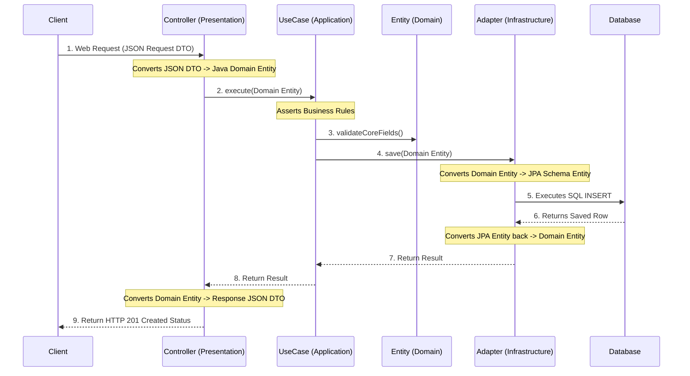

# Clean Architecture Flow in Spring Boot

In traditional MVC (Model-View-Controller) applications, the web endpoints, business logic, and database SQL logic often smear together. 

**Clean Architecture** restricts this by strictly separating the application into inward-facing layers. The absolute core rule is **The Dependency Rule**: source code dependencies can only point *inwards* toward your business domain.

### The 4 Layers Explained

1. **DOMAIN (Center Layer)**: 
   * Knows nothing about databases, JSON payloads, or Spring Boot components.
   * It comprises your strict business rules and pure Java entities.
2. **APPLICATION (Use Case Layer)**: 
   * Orchestrates the logical flow. Relies on the Domain entities to process actions (e.g., `CheckoutItemUseCase`, `CreateProductUseCase`).
3. **INFRASTRUCTURE (Outer Layer 1 - External World)**: 
   * Talks to the physical Database (PosgreSQL), external APIs (Stripe), email SMTP servers, and the file system.
4. **PRESENTATION (Outer Layer 2 - Internet World)**: 
   * Exposes Web APIs (REST endpoints) mapping into the application.

---

## 🔄 How The Execution Flow Works

When a Client calls the `POST /api/v1/products` API endpoint, the flow of data operates across layers like this:

## 🧩 Ports and Adapters
Notice in step `4` where the `UseCase` calls the `Adapter` to save data.

If `UseCase` directly executed SQL code, it would violate the Dependency Rule (an Inner layer depending on an Outer layer). Clean Architecture solves this using the **Ports and Adapters** pattern:

1. Inside the **Domain**, we declare a strict Interface (Port) called `ProductRepository` defining a `save()` method.
2. The **UseCase** relies solely on executing that `ProductRepository.save()` interface without knowing what implements it.
3. Inside the **Infrastructure**, we have a `ProductRepositoryAdapter` class that implements the Domain's Interface, containing the actual Spring Data JPA database connection.

This physical separation means your core business layer doesn't even know it's plugged into a PostgreSQL database. If you transition to a NoSQL database like MongoDB later, you simply rewrite the Infrastructure Adapter independently, leaving your core Domain flawlessly intact.
